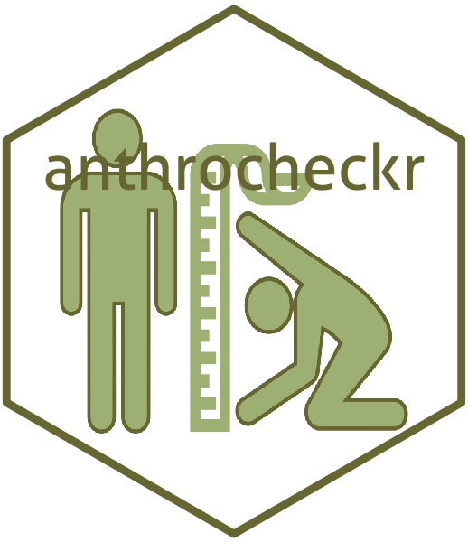

<!-- README.md is generated from README.Rmd. Please edit that file -->

```{r setup, include = FALSE}
knitr::opts_chunk$set(
  collapse = TRUE,
  comment = "#>",
  fig.path = "man/figures/README-",
  out.width = "100%"
)
```
# anthrocheckr: An Implementation of Anthropometric Measurement Standardisation Tests in R 

[](https://www.repostatus.org/#active)
[](https://www.tidyverse.org/lifecycle/#maturing)
[](https://cran.r-project.org/package=anthrocheckr)
[](https://travis-ci.org/nutriverse/anthrocheckr)
[](https://ci.appveyor.com/project/nutriverse/anthrocheckr)

Ensuring the precision and accuracy of measurements is critical when collecting anthropometric data. Anthropometrists are usually tested for precision and accuracy of measurement through standardisation tests performed prior to anthropometric data collection. This package provides functions to calculate inter- and intra-observer technical error of measurement (TEM) to assess precision of measurements.

## Installation

You can install the development version of `anthrocheckr` from [GitHub](https://github.com/nutriverse/anthrocheckr) with:

```{r install, echo = TRUE, eval = FALSE}
if(!require(devtools)) install.packages("devtools")
devtools::install_github("nutriverse/anthrocheckr")
```


