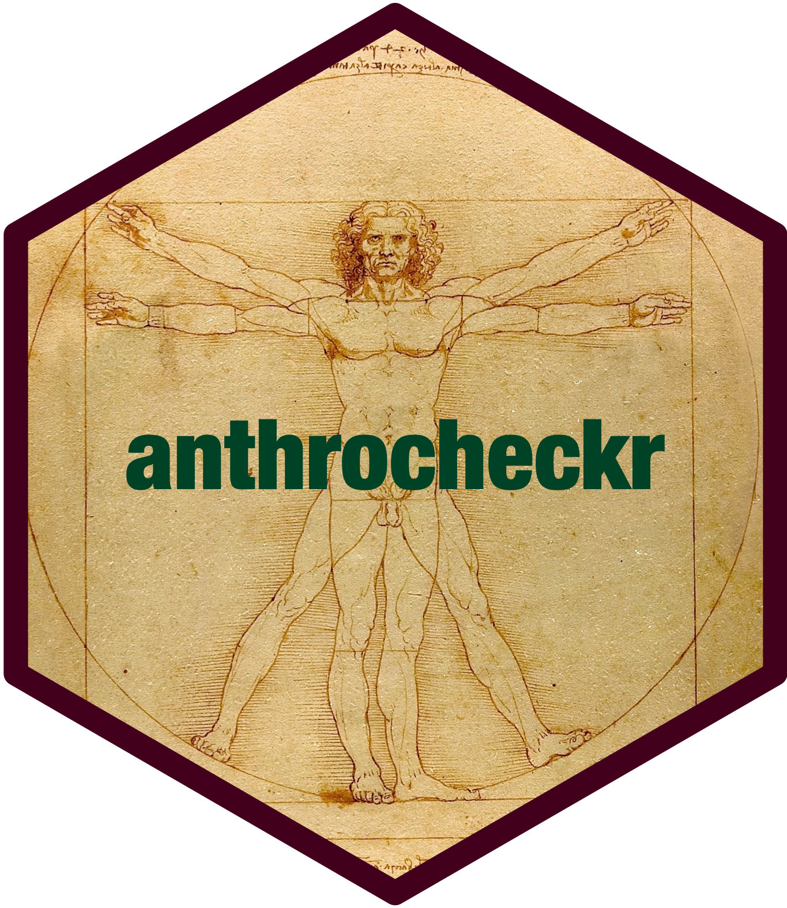

# anthrocheckr: An Implementation of Anthropometric Measurement Standardisation Tests 

<!-- badges: start -->

[](https://www.repostatus.org/#wip)
[](https://lifecycle.r-lib.org/articles/stages.html#experimental)
[](https://github.com/nutriverse/anthrocheckr/actions/workflows/R-CMD-check.yaml)
[](https://github.com/nutriverse/anthrocheckr/actions)
[](https://github.com/nutriverse/anthrocheckr/actions/workflows/test-coverage.yaml)
[](https://app.codecov.io/gh/nutriverse/anthrocheckr)
[](https://www.codefactor.io/repository/github/nutriverse/anthrocheckr)
[](https://zenodo.org/badge/latestdoi/162917178)
<!-- badges: end -->

Ensuring the precision and accuracy of measurements is critical when
collecting anthropometric data. Anthropometrists are usually tested for
precision and accuracy of measurement through standardisation tests
performed prior to anthropometric data collection. This package provides
functions to calculate inter- and intra-observer technical error of
measurement (TEM) to assess precision of measurements.

## What does the package do?

`{anthrocheckr}` provides functions for:

1.  Calculating standard summaries for intra-observer or inter-observer
    measurements;

2.  Calculating intra-observer or inter-observer technical error of
    measurement (TEM) for multiple subjects and for multiple
    measurers/observers;

3.  Calculating multiple measurers/observers relative technical error of
    measurement (relative TEM);

4.  Calculating intra-observer total technical error of measurement
    (total TEM);

5.  Calculating coefficient of reliability; and,

6.  Calculating bias in measurements/observation against a gold
    standard.

## Installation

`{anthrocheckr}` is not yet on [CRAN](https://cran.r-project.org) but
can be installed from the [nutriverse R
Universe](https://nutriverse.r-universe.dev) as follows:

``` r
install.packages(
  "anthrocheckr",
  repos = c('https://nutriverse.r-universe.dev', 'https://cloud.r-project.org')
)
```

## Usage

### Calculate intra-observer and/or inter-observer summaries

The *mean*, *standard deviation*, and *maximum difference in
measurements* are the requisite summary measures for various
anthropometric measurement standardisations tests. These can be
calculated as follows:

``` r
## Intra-observer mean for weight ----
weight_df <- subset(smartStdLong, subset = measure_type == "weight")

calculate_mean(weight_df$measure_value, index = weight_df$observer)
#>    index   mean
#> 1      0 14.655
#> 2      1 14.410
#> 3      2 14.560
#> 4      3 14.580
#> 5      4 14.545
#> 6      5 14.285
#> 7      6 14.650
#> 8      7 14.665
#> 9      8 14.650
#> 10     9 14.650
#> 11    10 14.615
```

``` r
## Intra-observer sd for weight ----
calculate_sd(weight_df$measure_value, index = weight_df$observer)
#>    index       sd
#> 1      0 1.793988
#> 2      1 1.742926
#> 3      2 1.753913
#> 4      3 1.757870
#> 5      4 1.743703
#> 6      5 2.024657
#> 7      6 1.764116
#> 8      7 1.691861
#> 9      8 1.810932
#> 10     9 1.735238
#> 11    10 1.699311
```

``` r
## Intra-observer max difference for weight ----
weight_df_wide <- tidyr::pivot_wider(
  weight_df, 
  names_from = c(measure_type, measure_round), 
  values_from = measure_value, names_sep = "_"
)

calculate_max(
  abs(weight_df_wide$weight_1 - weight_df_wide$weight_2), 
  index = weight_df_wide$observer
)
#>    index max_diff
#> 1      0      0.2
#> 2      1      0.8
#> 3      2      0.3
#> 4      3      0.2
#> 5      4      0.5
#> 6      5      6.2
#> 7      6      0.5
#> 8      7      0.4
#> 9      8      0.4
#> 10     9      0.4
#> 11    10      0.9
```

### Calculate intra-observer and inter-observer technical error of measurement (TEM)

``` r
## Inter-observer max difference for weight ----
weight_df_wide <- tidyr::pivot_wider(
  weight_df, 
  names_from = c(measure_type, measure_round), 
  values_from = measure_value, names_sep = "_"
)

inter_tem <- calculate_tem(
  abs(weight_df_wide$weight_1 - weight_df_wide$weight_2), 
  n = nrow(weight_df_wide)
)
```

which gives

    #> [1] 0.4507065

``` r
## Intra-observer max difference for weight ----
weight_df_wide <- tidyr::pivot_wider(
  weight_df, 
  names_from = c(measure_type, measure_round), 
  values_from = measure_value, names_sep = "_"
)

intra_tem <- calculate_tem_cohort(
  df = weight_df_wide, m1 = "weight_1", m2 = "weight_2",
  index = "observer", n = nrow(weight_df_wide)
)
```

which gives

    #>    observer        tem
    #> 1         0 0.02430862
    #> 2         1 0.10180195
    #> 3         2 0.03567530
    #> 4         3 0.01906925
    #> 5         4 0.05090097
    #> 6         5 0.41849297
    #> 7         6 0.04156047
    #> 8         7 0.03089572
    #> 9         8 0.03437758
    #> 10        9 0.03302891
    #> 11       10 0.08867715

### Calculating relative technical error of measurement

``` r
mean_weight <- calculate_mean(
  weight_df$measure_value, index = weight_df$observer
)

calculate_relative_tem(intra_tem$tem, mean_weight$mean)
#>  [1] 0.1658725 0.7064674 0.2450227 0.1307905 0.3499551 2.9295973 0.2836892
#>  [8] 0.2106766 0.2346593 0.2254533 0.6067543
```

## Citation

If you use the `{anthrocheckr}` package in your work, please cite using
the suggested citation provided by a call to the `citation()` function
as follows:

``` r
citation("anthrocheckr")
#> To cite anthrocheckr in publications use:
#> 
#>   Ernest Guevarra (2024). _anthrocheckr: An Implementation of
#>   Anthropometric Measurement Standardisation Tests_. R package version
#>   0.0.0.9000, <https://nutriverse.io/anthrocheckr/>.
#> 
#> A BibTeX entry for LaTeX users is
#> 
#>   @Manual{,
#>     title = {anthrocheckr: An Implementation of Anthropometric Measurement Standardisation Tests},
#>     author = {{Ernest Guevarra}},
#>     year = {2024},
#>     note = {R package version 0.0.0.9000},
#>     url = {https://nutriverse.io/anthrocheckr/},
#>   }
```

## Community guidelines

Feedback, bug reports and feature requests are welcome; file issues or
seek support [here](https://github.com/nutriverse/anthrocheckr/issues).
If you would like to contribute to the package, please see our
[contributing
guidelines](https://nutriverse.io/anthrocheckr/CONTRIBUTING.html).

Please note that the `{anthrocheckr}` project is released with a
[Contributor Code of
Conduct](https://nutriverse.io/anthrocheckr/CODE_OF_CONDUCT.html). By
contributing to this project, you agree to abide by its terms.

 

[](https://nutriverse.io)
